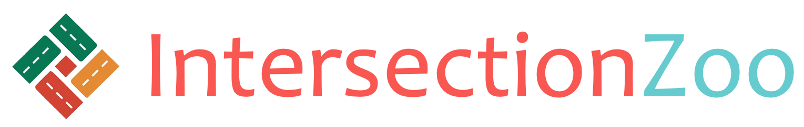

<p align="center">
  
</p>
# IntersectionZoo: Eco-driving for Benchmarking Multi-Agent Contextual Reinforcement Learning

[](https://www.repostatus.org/#active)
[](https://github.com/mit-wu-lab/scenarioenv/blob/main/LICENSE)


The working documentation of IntersectionZoo can be found [here](https://greenwave-docs.readthedocs.io/en/latest/).

IntersectionZoo provides a multi-factorial eco-driving environment for benchmarking contextual reinforcement learning algorithms. IntersectionZoo is built to reflect the realistic version of the eco-driving problem by calibrating the environments to reflect realistic conditions. It is designed to be a flexible and easy-to-use tool for developing and comparing contextual reinforcement learning algorithms.

## Installation

1. Install SUMO (ideally 1.12, but 1.13 seems to work as well) according to your OS, and make sure that the env var SUMO_HOME is set.
2. Create a conda env or venv with python 3.7
3. Install dependencies `pip install -r requirements.txt`

## Run Instructions (local)
`<dir>` is where all the training artifacts will be stored and/or the checkpoints will be retrieved (to evaluate or restart the training). Will be created if it doesn't exist.

If you haven't set the `WANDB_API_KEY` env var (see below), set `WANDB_MODE` to `offline`.

### Examples
From the root of the repo and the correct venv/ conda env, run the following command to train the agents. Check train.py for more options.

`python code/train.py --dir <exp_dir>`

`python code/train.py --dir <exp_dir> --kwargs <python dict with arguments to override the config in main.py>`

Example:
`python code/train.py --dir wd/test --kwargs "{'wandb_proj':'scenario-env'}" `

From the root of the repo and the correct venv/ conda env, run the following command to evaluate the trained agents on a given intersection dataset. Check evaluate.py for more options. Note that --dir should be the same as the directory used for training.

`python code/evaluate.py --dir <exp_dir>`

From the root of the repo and the correct venv/ conda env, run the following command to visulize the trained agents on a given intersection dataset. Check visualize.py for more options. Note that --dir should be the same as the directory used for training.

`python code/visualize.py --dir <exp_dir>`

## Getting started

### Config
The default config is stored in `containers/config.py` along with documentation for each field.
Important fields:

- `run_mode`, can be set to 'train',  'single_eval'
(i.e. runs a single episode, useful for visualisation or a quick check) or 'full_eval'
(i.e. evaluates all the possible environments as specified)
- `task_context` a `TaskContext` object which specifies which environments are used
  - When training/single_eval an env is chosen uniformly at random, in full eval each possible env configuration will be run
  - Can either be a `NetGetTaskContext`, i.e. a synthetic dataset (good for training), or a `PathTaskContext` i.e. a real world dataset
  - see `containers/task_context` for more details.
- `n_steps` how many eval steps in training mode or different random seeds to use in eval mode
- `moves_emissions_models` uses specified MOVES surrogates for emissions modelling, none by default. Can be multiple condition to evaluate many scenarios at once (multiple weather for example).
Not recommended for training

### TaskContexts

Used to specify environments.

Typical example for training:
```python
task = NetGenTaskContext(
    base_id=[11],
    penetration_rate=[0.2],
    single_approach=True,
    inflow=ContinuousSelector(200, 400, 4),
    lane_length=ContinuousSelector(100, 600, 4),
    speed_limit=ContinuousSelector(6.5, 30, 4),
    green_phase=ContinuousSelector(30, 45, 3),
    red_phase=ContinuousSelector(30, 45, 4),
    offset=ContinuousSelector(0, 1, 5),
)
```

Example for evaluating on a synthetic dataset:
```python
task = NetGenTaskContext(
    base_id=[11],
    penetration_rate=[0.2],
    single_approach=False,
    inflow=ContinuousSelector(200, 400, 3),
    lane_length=ContinuousSelector(100, 600, 4),
    speed_limit=[10, 13, 20, 30],
    green_phase=35,
    red_phase=35,
    offset=0,
)
```

Example for evaluating on the dataset contained in the repo, one approach at a time:
```python
task = PathTaskContext(
    dir=Path('dataset'),
    single_approach=True,
    penetration_rate=0.2
)
```

## Weights and biases

To use Weights and biases (which is required for logging):

- set the ``WANDB_API_KEY`` environment variable with your personal API key
- set the project name in ``main.py``

if you are on your local machine you're all set!

If you work on SuperCloud (or don't have your API key set), you won't have access to the Internet during jobs, thus you need to set the env variable 
``WANDB_MODE`` to ``offline``, and then run periodically ``sync_wandb.sh`` to sync the data (you can do it from the 
login node, and during training). By default ``sync_wandb.sh`` only syncs experiements in the ``wd/`` folder, but you
can easily change the script to use another name.


## If you get `OSError: AF_UNIX path length cannot exceed 107 bytes:`
This might happen for batch jobs on Supercloud.

#### Solution

The best way to solve it is to (okay you usually should NEVER do that) modify line 183 of `.conda/envs/no-stop/lib/python3.7/site-packages/ray/node.py`
(the local installation of ray !) into this : `date_str = datetime.datetime.today().strftime("%H%M%S%f")`.

Basically this changes the name of ray sessions into a shorter name.
If you have time at hand you can probably ask the ray team to implement that.
